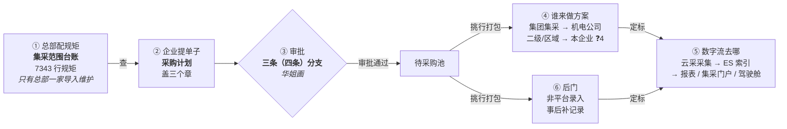
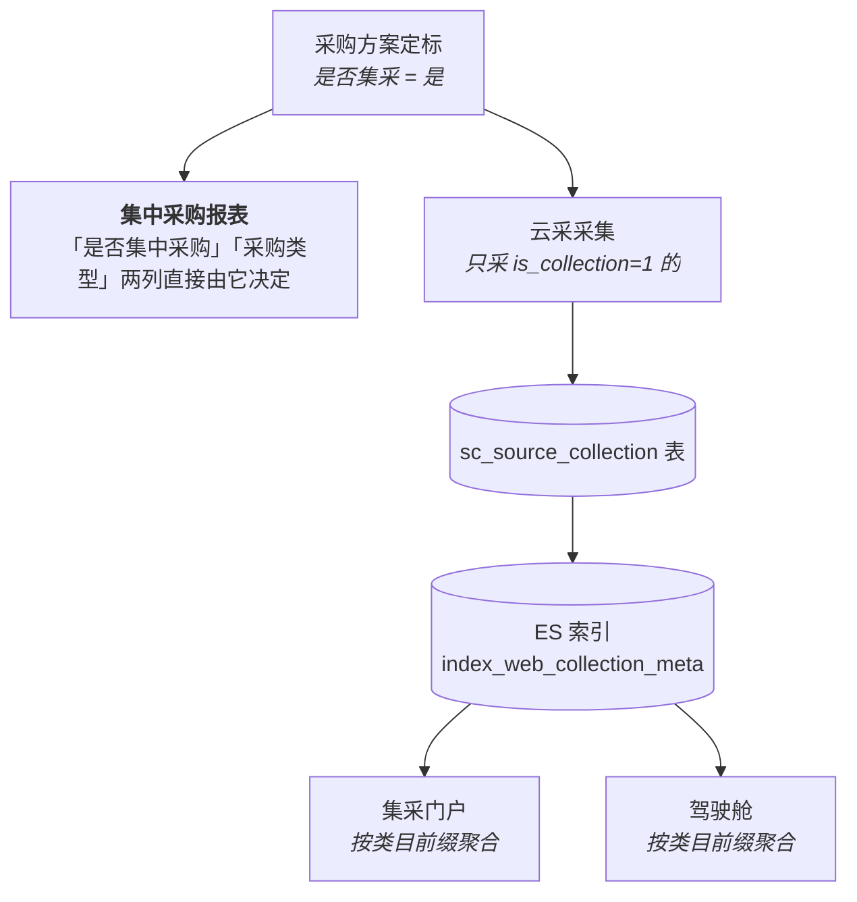

# 51 集采管控 · 全流程走一遍（改完之后的样子）

> 📌 **【2026-09-08 归档后】本主题的唯一入口已改为 [`10-开工总览-cc.md`](10-开工总览-cc.md)。**
> 9/8 会前的 30+ 份过程文档已整体移进 [`会前归档-20260908/`](会前归档-20260908/)，本文里指向 `10x`/`11c`/`12c~12e`/`10t`/`10v`/`10w` 等的链接请到那里找。
> **9/8 产品当面定稿后，判重、期初、导入冲突、「向上一级报给谁」四条口径已变**——以 [`12f`](12f-产品录音答案回收-cc.md) 和 [`13` §1](13-需求定稿-开发基线-cc.md) 为准。

> ❓ 标记的问题**大部分已在 9/8 当面问掉**，答案见 [`12f`](12f-产品录音答案回收-cc.md)；剩下的在 [`11d`](11d-判重方案与最后一轮问题-cc.md)。

> **日期**：2026-09-08 ｜ **工具**：cc
> **当前状态**：用一笔真实业务从头走到尾，把台账、三个单据、审批分支、报表串成一条线。
> **讲的是「改完之后」的样子**，不是今天的样子。❓ 标记 = 走到这一步会撞上的待定问题（编号对 `12e`）。
> **下一步**：❓ 的答案回来后，只改 `13` §1 那张表。
>
> 这份是给不看代码的人的。要任务清单看 `13c`，要问题话术看 `11c`。
> 前面 `10j`（三个单据的关系）和 `10s`（页面走查）讲的是**今天**的样子，本文讲**改完**的样子，可互相印证。

---

## 全景先摆出来



---

# 第一幕 · 总部配规矩

## 1.1 谁在配，怎么配

**只有总部一家在配，而且只有「导入 Excel」这一个入口。**
没有新增按钮、没有编辑按钮，改一条 = 作废旧的 + 导一条新的。

> ❓ **这一期也不下放**给二级集团自己维护。下放要做数据权限，是独立功能。
> **这句话要当场跟产品讲明白**，不然业务会以为上线就能自己维护。

## 1.2 一行规矩长什么样

改完之后，Excel 是 10 列。拿一条真实的举例：

| 列 | 值 | 意思 |
|---|---|---|
| 集采类目编码 | `17010101` | 柴机油这一类 |
| 集采类目名称 | 柴机油 | |
| 集采物料编码 | *(空)* | **空 = 管这一类下所有物料**；填了 = 只管这一个 |
| 集采物料名称 | *(空)* | |
| 影响范围编码 | `BU002` | 谁受这条规矩管 —— 冀东水泥这个板块 |
| 集采执行单位编码 | `CN13000363` | 谁去跑腿采购 —— 唐山冀东机电 |
| 🆕 **集采目录层级** | 二级集团集采 | **这条规矩是哪一级定的** |
| 🆕 **是否强管控** | 是 | **管得严不严** |
| 🆕 状态 | 生效 | 只读，作废后变"失效" |
| 🆕 失效时间 | *(空)* | 只读，作废那一刻记上 |

**这一行的意思，翻译成人话：**

> "冀东水泥（BU002）下面所有企业，凡是买柴机油这一类东西，
> 都算集团统一采购，由唐山冀东机电来办，而且管得严（强管控）。"

> 📌 **两个新字段是「行」的属性，不是「层级」的属性。**
> 同样是二级集团集采，A 行可以强管控、B 行可以弱管控。
> 判定的时候是「命中哪一行，就把这一行的三个值一起拿走」。

## 1.3 配的时候有三条规矩

### 规矩一：类目能配到末级了

以前只能配到二级（`1701` 润滑剂），现在 `170101`、`17010101` 都能配。

```
17            化工材料      一级
  1701        润滑剂        二级   ← 以前只能配到这
    170101    润滑油        三级
      17010101  柴机油      四级(末级)  ← 现在能配到这
        170101010186  柴机油^18L/桶^CH-4  具体物料
```

### 规矩二：集团配了，下面就不能再配（3.2）

集团把 `170101` 配成集团集采之后，**二级集团和区域就不能再配 `170101` 和它下面的东西了**。

> ❓ **6a** 那**上级**呢？集团配了 `170101`，二级集团还能配 `1701` 吗？
> **我的判断：能。** 匹配是从下往上找、找到就停 —— 买柴机油的时候，
> 在 `170101` 就命中集团那条停住了，根本走不到 `1701`。逻辑不冲突。

### 规矩三：同一个东西可以配多行（3.3）—— 这是这次最大的变化

以前一个物料在台账里**只能有一行**。现在允许：

```
行A   17010101   二级集团集采   影响范围 = BU002 冀东水泥      强管控=是
行B   17010101   区域集采       影响范围 = 唐山区域            强管控=否
```

> ❓ **5（前半）什么算「重复」被打回？**
> **我的建议：类目 + 物料 + 层级 + 影响范围，四个全一样才算重复。**
> 而且只跟「状态=生效」的比 —— **作废掉的行不占判重位置**，
> 不然业务作废一条之后想重新录一条一样的都录不进来。

> ❓ **6c** 导入 100 行里有 3 行冲突，**整批打回还是只拦那 3 行**？
> **我的建议：只拦冲突行。** 平台的导入框架本来就是逐行校验逐行报错的。

## 1.4 作废不是删除

点【作废】之后，那一行**还躺在表里**，只是状态变成"失效"、记上失效时间。
页面上能通过状态筛选翻出来，但**判定的时候不算数**。

**为什么不真删**：留痕。以后业务问"三月份那张单为什么算集采"，能查到当时那条规矩长什么样。

---

# 第二幕 · 小王提一张采购计划

**场景**：唐山某水泥厂（属于冀东水泥 BU002，在唐山区域）的采购员小王，
要买一批柴机油和一批轴承，进「采购计划编制」填单。

## 2.1 他填的时候，页面上是这样

| 区块 | 字段 | 小王能填吗 | 备注 |
|---|---|---|---|
| 基本信息 | 申请单位 | 唐山某水泥厂 | |
| 基本信息 | 是否集采 | ⚠️ **条件解锁** | 默认灰的填不了，只在特定条件下解锁（见第三幕） |
| 基本信息 | 🆕 集采目录层级 | ❌ 只读 | 灰的，系统算 |
| 基本信息 | 🆕 是否强管控 | ❌ 只读 | 灰的，系统算 |
| 需求物料 | 1　柴机油　`170101010186`　100 桶 | | |
| 需求物料 | 2　轴承　　`250201000031`　200 个 | | |

**三个字段他一个都填不了**，都是系统算的。他能碰的只有「是否集采」那一个框，
而且**只在特定条件下才解锁**（见第三幕）。

## 2.2 点【提交】那一秒，系统干了三件事

这三步是整套逻辑的核心，**慢慢看**。

### 步骤一 · 纵向找：每一行物料，台账里有没有规矩管它？（需求 6.2）

拿第 1 行柴机油举例：

```
先拿物料编码 170101010186 去台账查   →  没有按这个物料配的行
再拿末级类目 17010101 去查           →  ✅ 找到了！停
                                        （找到就停，不再往上找 170101、1701）
```

**"找到了" = 这一行物料是集采。** 这就是 6.2 说的"若属于则为是"。

### 步骤二 · 横向挑：找到的那一级上有两条都命中，用哪条？

**这一步需求原文没写，是个洞。**

小王的公司**既属于 BU002，又在唐山区域**，所以 §1.3 里那两行规矩**都命中他**：

```
行A   17010101   二级集团集采   BU002 冀东水泥    强管控=是
行B   17010101   区域集采       唐山区域          强管控=否
```

到底按哪条？—— 这决定了这行物料的「层级」记二级集团还是区域、「强管控」是是还是否。

> ❓ **5（后半）撞了听谁的？**
> **我的建议：范围越窄越优先 —— 区域 > 二级集团 > 集团。**
> 道理是"谁离这家企业更近，谁的规矩更贴合"，像买东西有「全国统一价」和「唐山门店特价」，你付门店价。
> **同一层级还撞的话**（比如两条都是二级集团集采、影响范围一个填 `BU002` 一个填 `BU002/BU003`），
> 取**最后录进去**的那条。

假设按建议走，柴机油这行拿到：**是集采 / 区域集采 / 弱管控**。

### 步骤三 · 跨行汇总：两行物料各有各的值，表头填什么？（需求 6.3 / 6.4）

假设轴承那行命中的是**集团集采 + 强管控**，那么：

| | 柴机油行 | 轴承行 | **表头** | 规则 |
|---|---|---|---|---|
| 是否集采 | 是 | 是 | **是** | 都是"是"就是"是" |
| 集采目录层级 | 区域集采 | 集团集采 | **集团集采** | **取最小 = 层级最高 = 最严的赢** |
| 是否强管控 | 弱 | 强 | **强** | **有一个强就是强** |

> 📌 **步骤二和步骤三方向是反的，这是全场最容易搞混的地方：**
> ```
> 步骤二  这一行归谁管    → 范围越窄越优先（区域赢）    像门店特价，更具体的赢
> 步骤三  这一单怎么审批  → 层级越高越优先（集团赢）    像一车货有危险品，按最严的运
> ```
> 一个是**行**的事，一个是**单**的事。不矛盾，因为问的不是同一个问题。

> ❓ **一张单混了层级，整单被拽到最长审批链，业务接受吗？**
> 上面这张单只有 1 行是集团集采，整张单就都按集团那档走最长的审批。
> 这是"取最小"的必然结果。**我的默认：就按需求来，宁可多审。**
> 想走快就让业务把集团集采的物料单独拆一张单。

## 2.3 有一种情况会被直接拦住：混采

如果小王的单子里，柴机油是集采、但另一样东西**不在台账里**（非集采）：

> **"柴机油数据是集采物料，集采和非集采不允许同时采购"**

**整张单只有一个「是否集采」的章，混了说不清这章盖什么**，所以禁止。
他得拆成两张单：集采的一张、非集采的一张。

> ⚠️ **今天这个弹框是坏的** —— 点确定点取消都没反应，页面永久卡死只能刷新。
> 三个页面一模一样的毛病。**这次修掉**，改成明确提示、可关闭。

## 2.4 三个章存下来，递给审批流

表头那三个值存进单据，同时递给工作流平台三个变量：

| 变量 | 值 |
|---|---|
| `isCollection` | `是` |
| `collectionLevel` | `集团集采` |
| `isStrongControl` | `是` |

⚠️ **递的是中文，不是 1/0**（现有那个变量就是中文，跟着来，否则华姐要写两套条件）。

---

# 第三幕 · 审批走哪条路

## 3.1 华姐画的分支图，靠这三个变量分叉

| 是否集采 | 强管控 | 层级 | 「是否集采」那个框 | 走哪条路 |
|:--:|:--:|---|---|---|
| **否** | — | — | ❌ 灰的 | 普通流程。**不能把非集采改成集采**，只能反过来 |
| **是** | 强 | **集团集采** | ❌ **灰的，改不了** | **分支①**：企业 → 二级集团 → 集采执行单位 → 总部（最长） |
| **是** | 强 | 二级集团/区域 | ✅ 能改 | **分支②**：改成"否"要**向上一级审批**<br>企业/区域发起 → 报二级集团；二级集团发起 → 报总部 |
| **是** | 弱 | 二级集团/区域 | ✅ 能改 | **分支③**：改成"否"走**原流程**，不加审批 |
| **是** | **弱** | **集团集采** | ❓ | ❓ **需求里没写这一格** |

> ❓ **3 「弱管控 + 集团集采」怎么走？**
> **这一格不是理论问题 —— 上线第一天所有数据都掉在这里。**
> 因为期初默认是「层级=集团集采、强管控=否」，7343 条老规矩全是这个组合。
> **我的建议：能改，改成否走原流程**（跟今天行为一致，最保守）。
> **必须让华姐把这条分支也画进去**，不然这批单子会卡在审批里出不来。

## 3.2 强管控到底"强"在哪

就一句话：**改成"否"要付代价。**

- **弱管控** = 采购员觉得这次不该走集采，改成否，流程照旧 —— **改了没代价**
- **强管控** = 改成否要多一级领导批 —— **改了有代价**
- **强管控 + 集团集采** = 连改都不让改 —— **没得商量**

> 💡 强管控在代码里**只有这一个用途**。此外它会显示在页面上（审批人要看）、
> 显示在待采购池清单里（机电公司拿它排优先级，人肉看）。没有第三个地方拿它做判断。

## 3.3 改成"否"的时候，要填理由

采购员把框改成否 → 弹出一个**必填**的文本框，让他写为什么。

**为什么必须有**：分支②那级领导收到这张单，他要判断的就是"这个否改得合不合理"。
没有理由，他就只看到一个"否"字，**那级审批就是走过场**。

## 3.4 审批人打开的是详情页

这一点特别容易被漏：**审批人不进编辑页，他打开的是详情页。**

所以三个详情页（采购计划详情、采购方案详情、非平台录入详情）**也要加这两个字段**。
不加的话，分支②那级领导根本不知道自己为什么会收到这张单。

---

# 第四幕 · 计划过了，掉进待采购池

审批通过之后，**这张计划上的每一行物料，各自变成池子里的一条记录**。
一张计划 10 行，就掉 10 条进去。池子记着"我是从哪张计划的第几行来的"。

**池子是计划和方案之间的中转站。**

池子里的记录也带着「集采目录层级」和「是否强管控」—— 机电公司打开清单页，
一眼能看出哪些是集团集采的、哪些是强管控的，据此排采购优先级。

---

# 第五幕 · 谁来做采购方案（这一幕有个死局）

采购方案回答的是"**打算怎么买**"：公开招标？询价？找哪几家？
做方案的人从池子里挑几条打包成一个方案（可以把好几张计划的行合并，量大好谈价）。

## 5.1 集团集采：本企业不能自己做

小王的公司想自己给柴机油做方案 → **被拦住**：

> **"集采物资采购且有计划，请联系集采执行单位组织采购"**

**意思是：这活不该你干。** 该谁干？—— **台账上「集采执行单位」那一列写着的那家公司**，
本例是唐山冀东机电。它从池子里挑行，统一去谈，量大价优。这就是"集采"的本意。

⚠️ 这道拦截**还有一个条件**：必须**每一行都有采购计划号**才拦。全是集采但有行没计划号的，不拦。

## 5.2 二级集团 / 区域：❓ 这里是个死局

需求 §5 明写：**二级集团、区域这两档，无需配置集采执行单位。**

那问题来了 ——

```
没有集采执行单位可以联系   ✗
机电公司也筛不到这张单     ✗
本企业又被那道拦截挡住     ✗
→ 这张单子没人能接
```

> ❓ **4 二级集团/区域层级的单子，谁做方案？**
> **我的建议：那道拦截只对「集团集采」生效**，二级集团和区域就让本企业自己做。
>
> 🔴 **这条最危险的地方不是难改（就一个 if），是猜错了上线当天完全不暴露** ——
> 要等业务真配了第一条二级集团的规矩、那张单卡住没人能接，才会炸。

## 5.3 混层级的单子怎么算

一张方案里既有集团集采的物料、又有区域集采的：
表头按 6.3 取最小 = **集团集采** → 那道拦截生效 → **拦住，交给机电公司**。

业务上讲得通：既然掺了集团统采的东西，就该交给集采执行单位统一谈，
不能因为混了几行区域的物料就绕开集团管控。

---

# 第六幕 · 非平台录入这个后门

有些买卖压根没走平台（线下谈的、紧急采购的），事后要补一条记录进系统。
**这是唯一能绕过所有管控的口子，所以必须一起堵。**

它的行为**跟采购计划一样，不跟采购方案一样**：

| | 采购计划 | 采购方案 | 非平台录入 |
|---|---|---|---|
| 三个章 | ✅ 盖 | ✅ 盖 | ✅ 盖 |
| 混采拦截 | ✅ 有 | ✅ 有 | ✅ 有 |
| "请联系集采执行单位" | ❌ 没有 | ✅ 有 | ❌ 没有 |

它是事后补录，本来就没走平台，**不存在"该谁做"的问题**，所以不加那道拦截。

---

# 第七幕 · 定标之后，这些数字流去哪了

**这一幕是最容易被忘的，但它决定了会不会被领导先发现。**



**第二周把"是否集采"的判定口径整个换掉，等于换了这些报表的分母：**

| 口径变化 | 报表数字的方向 |
|---|---|
| 加了"状态=生效"过滤 | 作废规矩的物资不再算集采 → **降** |
| 加了"影响范围"过滤 | 不在管辖内的企业不再算集采 → **降** |
| 类目放开到末级 | 原来匹配不到的现在能匹配 → **升** |
| 允许改成"否" | 弱管控的单子会被采购员改掉 → **降** |

**净效果算不准，但一定会变。** 而且 ES 里的历史数据**不会自动重算**，
新旧口径会混在同一个索引里，按时间段一查就是"半旧半新"。

> 📢 **这不是技术问题，是"别让领导先发现"。**
> 上线前后各跑一次对账，**并且提前跟看报表的人打招呼**。

---

# 第八幕 · 上线那天

## 8.1 期初：给 7343 条老规矩补两个新字段

老数据的「集采目录层级」和「是否强管控」全是空的。空着新逻辑判断不出来，**单子会卡在审批里**。

**这不是清空重导，是在现有的行上 UPDATE 补两列。** 行还是那些行。

> ❓ **1 是一刀切，还是按类目分？**
>
> **一刀切** —— 不管什么类目，全填一样的：
> ```sql
> UPDATE sc_plan_product_range SET is_strong_control = 0;   -- 全部弱管控
> ```
> **按类目分** —— 不同类目填不同值：
> ```sql
> UPDATE ... SET is_strong_control = 1 WHERE category_code IN ('1501','1001');  -- 钢材、煤炭 → 强
> UPDATE ... SET is_strong_control = 0 WHERE category_code IN ('2502','2302');  -- 其余 → 弱
> ```
> **第二种需要产品给一张「哪些类目算强管控」的对照表** —— 那张表只有他有。
> **这就是要"生产类目清单"的真正原因**：没有那张表，第二种 SQL 写不出来。

> ❓ **2 填什么？**
> **我的建议：层级全填「集团集采」**（今天系统里本来就只有这一档，没争议）；
> **强管控全填「否」**。
> 填"是"的话，这七千多条规矩对应的单子**上线第二天全走最严那档**，
> 全集团审批链一夜之间集体变长，业务要炸。先全填否，之后再一批批调。

**顺带要处理的**：约 600 条死数据（物料主数据查不到 207 条 + 已停用 389 条，占 8%）。
建议标成"失效"，不物理删。

**还有一个静默的坑**：台账里影响范围那个串**存错了** ——
缺 `BU012`、`BU013` 写成了 `BU0013`。今天没事（过滤还没启用），
**第二周一启用，这两个 BU 下 8 个组织提交的单子会全部静默判为"不是集采"**，不报错不提示。
期初脚本必须把它修对。

## 8.2 上线顺序不能反

```
1. 建表（新列全 NULL，不影响任何现有逻辑，可以提前）
2. 期初脚本            ← 必须在代码发版之前跑完，否则新代码读到空值
3. 换导入模板 xlsx      ← 必须和代码同时，否则业务拿旧模板导进来错位落库
4. 后端 + 前端发版
5. 华姐切流程图         ← 必须在 4 之后
6. 上线后体检 + 报表对账
```

⚠️ **5 和 4 反了会卡单**：她先切图 → 新起的单子变量是空的 → 分支判断不出来 → 卡在审批里。
在途的单子走老图，不受影响。

---

# 一页记住

## 整套逻辑就三步

```
步骤一  纵向找   物料码 → 末级类目 → 逐级往上，找到就停        需求 6.2 写了
步骤二  横向挑   同一级上两条都命中，范围越窄越优先            ❓ 原文没写
步骤三  跨行汇总 层级取最小(集团赢)、强管控有强取强            需求 6.3/6.4 写了
```

## 三个章各是什么

| 章 | 谁决定 | 用来干什么 |
|---|---|---|
| **是否集采** | 台账里查得到就是"是" | 决定这单走不走集采流程；采购员**只能改成否，不能改成是** |
| **集采目录层级** | 命中那行台账上写的，跨行取最严 | 决定审批链多长、谁来做方案 |
| **是否强管控** | 命中那行台账上写的，有强取强 | 决定"是否集采"能不能改、改了要不要多审一级 |

## 走到哪一步会撞上哪个问题

| 走到哪 | ❓ | 猜错的后果 |
|---|---|---|
| 配规矩：什么算重复 / 撞了听谁的 | **5** | 🟡 收敛在一个方法里，改一处 |
| 配规矩：二级集团能配上级吗 | 6a | 🟢 一个校验 |
| 配规矩：导入冲突全拦还是拦行 | 6c | 🟢 |
| 提单子：混层级拽长审批链 | — | 🟢 按需求来 |
| 审批：弱管控 + 集团集采 | **3** | 🔴 **上线当天 7343 条全落在这一格**，流程图没这条分支 |
| 做方案：二级集团/区域谁做 | **4** | 🔴 单子没人能接，**且上线当天不暴露** |
| 上线：一刀切还是按类目分 | **1** | 🔴 按类目分的话，没那张表脚本写不出来 |
| 上线：填什么 | **2** | 🔴 要重刷 7343 行，重刷期间判定全错 |

> **1234 有个共同点：猜错了不会当场报错，都是事后才炸。**
> 它们排在前面不是因为改起来贵，是因为**发现得晚**。

---

## 附 · 本文结论的出处

| 说法 | 证据 |
|---|---|
| 台账只有导入一个入口 | `PlanProductRangeServiceImpl` 无新增/编辑接口；页面只有导入和删除按钮 |
| 类目层级示例 | `12b` §1（用户与产品对过的真实编码） |
| 三个页面共用判集采接口 | `POST /e/business/source/plan/queryInProductRangeNum`（`PlanController:485`）；前端 `saveOrSubmit.vue:1584`、`basicInfo2.vue:4304`、`increasedListAdd.vue:489` |
| 6.2 只回答"是否集采" | `01c` §6.2 原文末句"若属于则为是"，未涉及层级与强管控取值 |
| 混采弹框三页全死锁 | `saveOrSubmit.vue:1592-1603`、`basicInfo2.vue:4312-4325`、`increasedListAdd.vue:497-508`，`onOk(){}`/`onCancel(){}` 空实现 |
| 方案拦截含 planCode 条件 | `basicInfo2.vue:4331-4334`；`grep 请联系集采执行单位` 全前端仅此一处 |
| 二级集团/区域无需配执行单位 | `01c` §5 原文 |
| 6.5 三条分支缺"弱+集团" | `01c` §6.5：①要求强+集团，②③明写"二级集团集采、区域/企业" |
| 期初默认落在缺的那格 | `13` §1.5 D23（层级=集团集采）+ D24（强管控=否） |
| 工作流变量递中文 | `SourceWorkflowAdapterBuilder.java:230-234` 实测 |
| 待采购池是计划与方案的中转 | `10j` §一；`SchemeToPurchaseController:428/485` |
| 下游报表/ES/门户/驾驶舱 | `CentralizedProcurementReportServiceImpl:390/815/503/504`；`SourceCollectionMapper:49`；`CockpitCollectionProviderImpl:182/190`；`CentralizedProcurementPortalServiceImpl:383` |
| 600 条死数据 | `10p` 全表体检（uat 7343 行） |
| BU 编码存错 | 主数据 `belong_bu_code` = BU001~BU013；台账 `bu_code` 串缺 BU012、BU013 写成 BU0013（`10w` §5.2） |
| 强管控在代码里只有一个用途 | 全仓 `isStrongControl` 仅用于 6.5 分支判断；页面与待采购池清单为展示用 |
